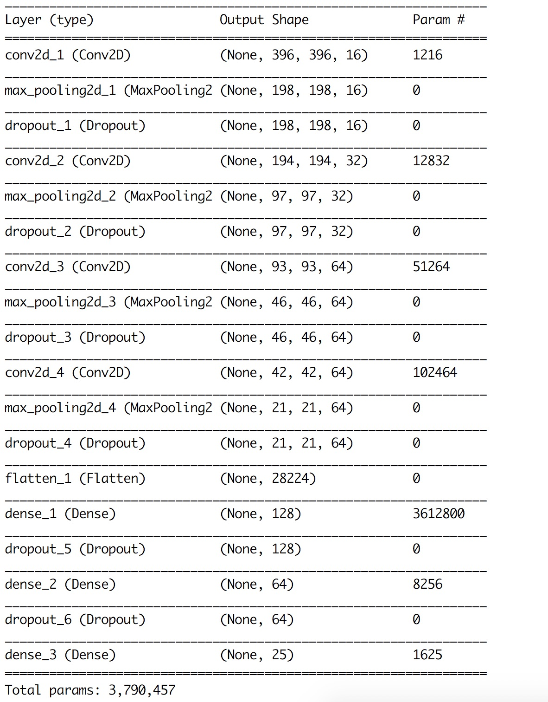

# deep-learning-multi-label-image
+ [Dataset](https://drive.google.com/file/d/1dNa_lBUh4CNoBnKdf9ddoruWJgABY1br/view?usp=sharing)

## Requirements
----------------
+ RAM: 8GB
+ Docker
+ Docker-Compose
+ Code was synced to /home/jovyan/work folder

## Libraries
-------------
+ Keras
+ Tensorflow


### Usage
----------

+ Run jupyter noteboook
```
$ cd devops
$ docker-compose up
```

+ Run training model
```
docker exec -it [container_name] bash
cd /home/jovyan/work
python multi-label-image.py
```



### Reference
--------------
+ [Build your First Multi-Label Image Classification Model in Python](https://www.analyticsvidhya.com/blog/2019/04/build-first-multi-label-image-classification-model-python/)
+ [Predicting Movie Genres using NLP – An Awesome Introduction to Multi-Label Classification](https://www.analyticsvidhya.com/blog/2019/04/predicting-movie-genres-nlp-multi-label-classification/)
+ [Keras Conv2D and Convolution Layers](https://www.pyimagesearch.com/2018/12/31/keras-conv2d-and-convolutional-layers/)
+ [How to get started with Keras Deep Learing and Python](https://www.pyimagesearch.com/2018/09/10/keras-tutorial-how-to-get-started-with-keras-deep-learning-and-python/)